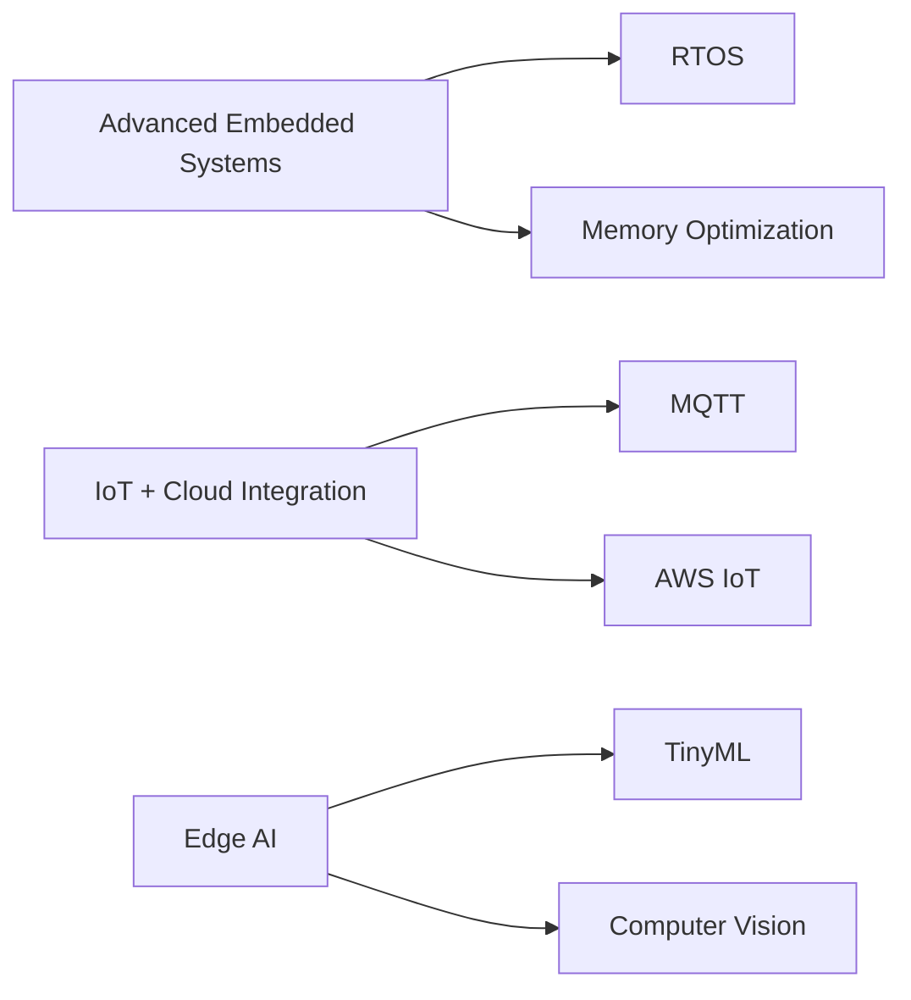

#  Hello, I'm Javier Siliacay!

<div align="center">
  
</div>

##  About Me

I'm a passionate embedded systems developer from the Philippines, currently studying at **USTP**. I specialize in building innovative hardware projects using **C/C++** and various **Arduino/ESP-based microcontrollers**. I'm obsessed with clean code, working with sensors, and transforming ideas into functional electronic projects.

```c
#include <life.h>

void Javier::introduction() {
  char location[] = "Philippines";
  char university[] = "USTP";
  char course_program[] = "Bachelor of Science in Autotronics";
  const char* specializations[] = {"Embedded Systems","IoT","Circuit Diagrams","Electronics Ethical Hacking"};
  bool coffee_powered = true;

  while (coffee_powered) {
    buildCoolProjects();
    learnNewTechnologies();
    solveInterestingProblems();
  }
}
```

##  Tech Arsenal

<p align="center">
  <!-- Embedded / Hardware -->
  
  
  
  
  
  
  
  

  <!-- Web / Autoworx Stack -->
  
  
  
  
  
  
</p>

##  Microcontrollers I Master

<p align="center">
  
  
  
  
  
  
  
</p>

##  Top Projects

### Featured Projects

### 💻 Autoworx Repairs and Gen. Merchandise System

🌐 **Live:** https://autoworxcagayan.com  

A premium **Vehicle Repair Management System** built on a modern real-time web architecture for automotive service operations, automation, and analytics.
It bridges Autotronics hardware data with an intelligent web dashboard.

#### 🧱 Full Tech Stack

**Frontend & Framework**

* Next.js (App Router)
* React 19
* TypeScript
* Tailwind CSS
* shadcn/ui (Radix UI)
* Framer Motion
* Lucide React

**Backend & Database**

* Supabase (PostgreSQL)
* Supabase Realtime (WebSockets live updates)
* Supabase Storage (vehicle & document uploads)

**Authentication & Security**

* NextAuth.js (Auth.js)
* Google OAuth
* Role-Based Access Control (RBAC)

**Integrations**

* Resend API (transactional emails)
* jsPDF + html2canvas (report PDFs)
* Leaflet + OpenStreetMap (shop geolocation)

**DevOps & Tooling**

* pnpm
* ESLint
* Zod

---

* 🔧 **Smart Engine Oil Monitoring System (Thesis)**
  Real-time engine oil contamination monitoring using ESP32 + turbidity sensor with web logging and predictive maintenance insights.

* 🎮 **Pachinko Quiz Game**
  Servo-based interactive quiz game with scoring logic.

* 🎯 **Timed Catapult System**
  Ultrasonic-based projectile velocity measurement.

* ⚡ **EMF Detector** – Analog EMF sensing with visual feedback

* 🧪 **Normal/Abnormal Mode System** – Operational logic monitoring

* 🌡️ **Temperature Monitoring System** – Alerts + logging

* 🔥 **Smoke & Gas Flame Detection** – Multi-sensor safety device

* 💡 **pH Detection with LCD** – Water acidity measurement

* 💧 **pH LED Indicator System** – Visual pH classification

* 🌬️ **Windmill Energy System** – Wind-to-voltage simulation

* 🗑️ **Automated Waste Segregator** – IR + rain sensor sorting

* 🔥🗑️ **Smart Fire–Gas–Bin Monitor** – Hazard + bin automation

### Educational Ethical Hacking Projects (Private)

* 📡 **WiFi Deauther** – ESP8266 network security research tool
* 📡 **WiFi & Bluetooth Jammer** – 2.4 GHz interference study platform
* 📡 **Dual-Band Deauther (2.4 / 5 GHz)** – Wireless disruption research

##  Current Learning Path


```mermaid
graph LR
    A[Advanced Embedded Systems] --> B[RTOS]
    A --> C[Memory Optimization]
    D[IoT + Cloud Integration] --> E[MQTT]
    D --> F[AWS IoT]
    G[Edge AI] --> H[TinyML]
    G --> I[Computer Vision]
```

##  GitHub Activity

* 💻 Arduino & IoT development
* 🔍 Sensor network research
* 📚 RTOS learning
* 🌱 Open-source hardware contribution

##  Connect with Me

<p align="center">
  <a href="https://www.facebook.com/siliacayjavier/" target="_blank">
    
  </a>
  <a href="https://www.instagram.com/yaboi_vier" target="_blank">
    
  </a>
</p>

---

<div align="center">
⚡ Made with 💻, 💡, and ☕ by Javier Siliacay  
<br><br>

</div>

---
