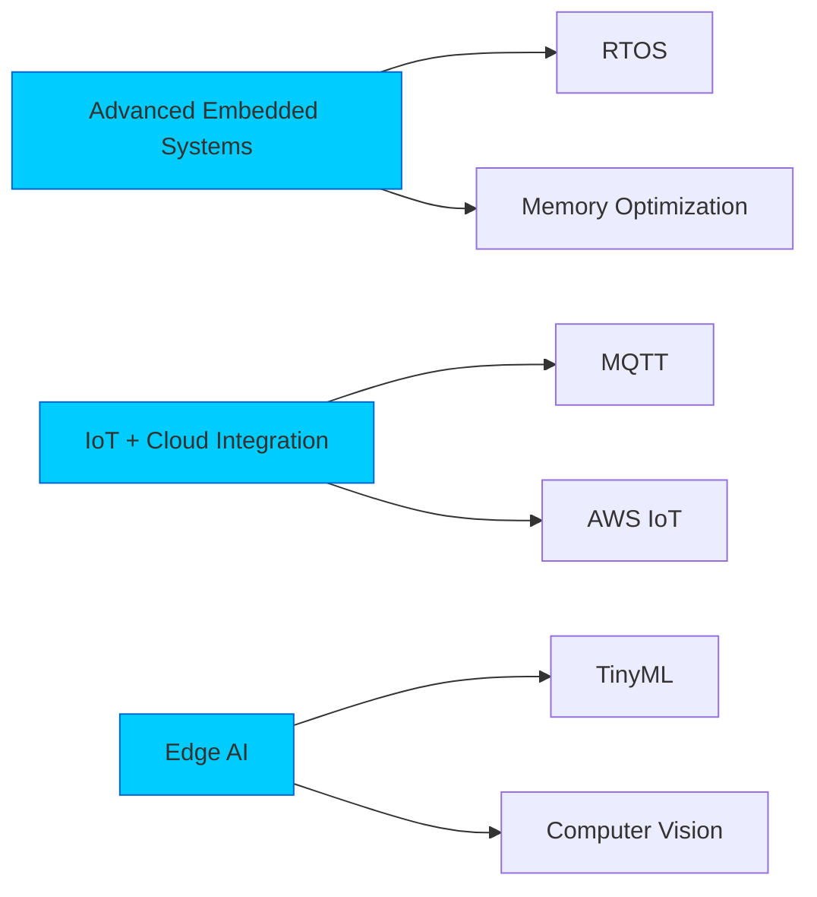

#  Hello, I'm Javier Siliacay!

<div align="center">
  
</div>

##  About Me

I'm a passionate embedded systems developer from the Philippines, currently studying at **USTP**. I specialize in building innovative hardware projects using **C/C++** and various **Arduino/ESP-based microcontrollers**. I'm obsessed with clean code, working with sensors, and transforming ideas into functional electronic projects.

```c
/* Quick intro in my favorite language */
#include <life.h>

void Javier::introduction() {
  char location[] = "Philippines";
  char university[] = "USTP";
  char course/program[] = "Bachelor of Science in Autotronics";
  char specializations[] = {"Embedded Systems", "C/C++", "Arduino", "ESP32/ESP8266", "BW16"};
  bool coffee_powered = true;
  
  while(coffee_powered) {
    buildCoolProjects();
    learnNewTechnologies();
    solveInterestingProblems();
  }
}
```

##  Tech Arsenal

<p align="center">
  
  
  
  
  
  
  
</p>

##  Microcontrollers I Master

<p align="center">
  
  
  
  
  
  
</p>

##  Top Projects

### Featured Projects

- 🔧 **Smart Engine Oil Monitoring System**(Thesis)  
  Real-time oil quality tracking using ESP32 + SD + RTC + TFT. Monitors viscosity, contamination levels, and temperature patterns.

- 🎮 **Pachinko Quiz Game**   
  Interactive servo-based quiz ball game with scoring system and customizable question sets.

- 🎯 **Timed Catapult System**   
  Precision catapult with ultrasonic-based velocity detection that measures projectile speed.

- ⚡ **EMF Detector**: Detects electromagnetic field strength using analog sensors with intuitive feedback
  
- 🧪 **Normal/Abnormal Mode System**: Mode-switching system for operational logic monitoring
  
- 🌡️ **Temperature Monitoring System**: Real-time temp readings with alerts and logging 
  
- 🔥 **Smoke & Gas Flame Detection**: Safety device for fire/smoke/gas detection using sensors 
  
- 💡 **pH Detection with LCD**: Reads water/acidity levels with clear LCD interface 
  
- 💧 **pH Monitoring with LED Indicator**: LED-based pH level detection system 
  
- 🌬️ **Windmill Energy System**: Simulated windmill generating voltage based on wind speed

- 🗑️ **Automated Waste Segregator**: using IR and rain sensors with a stepper and servo system to detect and sort wet and dry objects.

### Educational Ethical Hacking Projects but private:
- 📡 **WiFi Deauther Project**  
  ESP8266-based educational tool for WiFi network exploration and security analysis. *For educational purposes only.*

 - 📡 **WiFi & Bluetooth Jammer Project**
ESP32-based experimental tool for exploring wireless signal interference and security testing. For educational and ethical research use only.
It interrupts the whole 2.4 GHz broadband! Everything that works on 2.4 GHz is being interfered, like: audio in speakers transmitted over Bluetooth, microphones on 2.4 GHz, smartphone connections, WiFi, RC drones, IoT devices, smart gadgets, wireless keyboards & mice—just anything on 2.4 GHz!

 - 📡 **2.4GHz & 5GHz Deauther Project**
A dual-band WiFi deauthentication tool designed for educational use only. Disrupts wireless connections on both 2.4GHz and 5GHz networks with a built-in web interface for scanning, selecting, and attacking.
It disconnects devices from any WiFi network — phones, laptops, routers, smart TVs, game consoles, IoT devices, cameras, and more.

##  Current Learning Path



##  GitHub Activity

- 💻 Working on several Arduino-based IoT projects
- 🔍 Researching efficient sensor networks for environmental monitoring
- 📚 Learning about real-time operating systems for embedded applications
- 🌱 Contributing to open-source hardware projects

##  Connect with Me

<p align="center">
  <a href="https://www.facebook.com/siliacayjavier/" target="_blank">
    
  </a>
  <a href="https://www.instagram.com/yaboi_vier" target="_blank">
    
  </a>
  <a href="#" target="_blank">
    
  </a>
  <a href="#" target="_blank">
    
  </a>
</p>

---

<div align="center">
  ⚡ Made with 💻, 💡, and a whole lot of ☕ by Javier Siliacay ⚡
  
  
</div>
